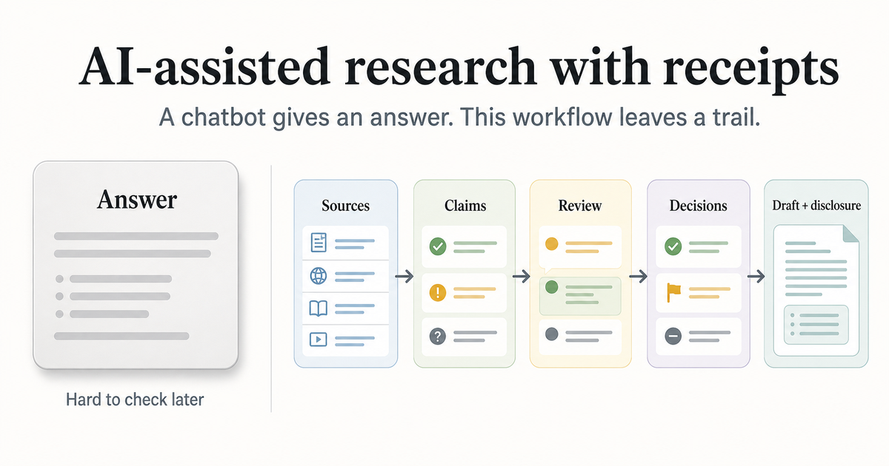
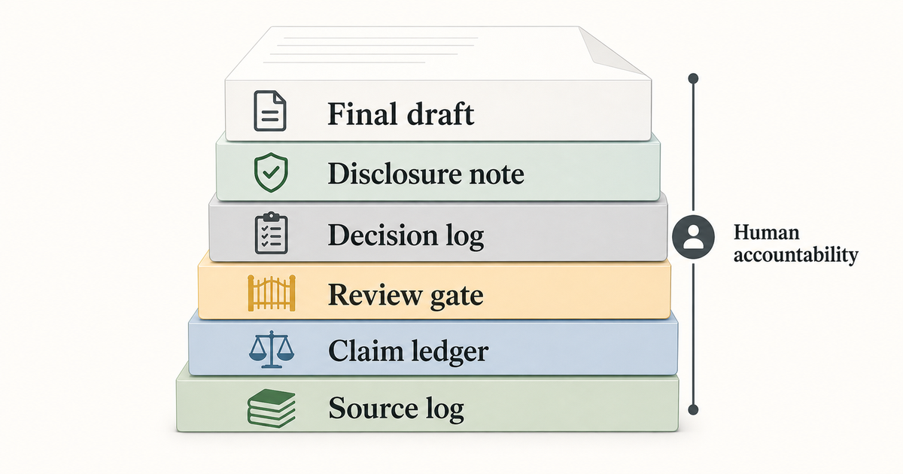

# Structured AI Research Workflows

AI-assisted research with receipts.

A chatbot can give you an answer.

This workflow leaves a trail.

That trail matters when the answer will support a memo, article, policy note or a draft meant for publication. In those settings, a good-looking paragraph is not enough. Someone has to know what was claimed, where it came from, what remained uncertain, and who decided to keep it.

This repository documents a small workflow for AI-assisted research. The main output is an inspectable research packet: claims, sources, uncertainty, review findings and human decisions.

## The problem

Pure chatbot research usually feels fast because the hard parts disappear from view.

The answer arrives as one smooth surface. It may cite sources. It may sound careful. It may even be mostly right.

But if you return to it two days later, the uncomfortable questions start:

- Which sentence came from which source?
- Which claims did the model add during drafting?
- Which sources were weak, missing or contradictory?
- Which uncertainty did the final prose hide?
- Which parts did a human actually check?

For a casual question, that may not matter. For research that other people will rely on, it does.

## What this adds

The workflow adds four small artifacts around the AI output:

- Claim ledger: the checkable statements.
- Source log: the evidence behind them.
- Review gate: the objections, failures and changes.
- Decision log: the human calls that shaped the final text.

The point is not to make AI sound more careful. The point is to make the work easier to inspect.

A later reader, reviewer or decision-maker should be able to answer: which claims were made, which sources support them, where uncertainty remains, what changed during review, and where human judgment entered the process.

## Why not just use a better chatbot?

Better models help. They do not remove the need for a record.

| Pure chatbot workflow | Structured workflow |
|---|---|
| Gives one answer. | Keeps the answer plus the trail behind it. |
| Sources may be present, but claim-to-source mapping is often vague. | Each important claim can point back to source support. |
| New claims can appear during drafting without being noticed. | New draft claims get logged and checked. |
| Weak evidence can become confident prose. | Evidence quality and confidence are separated. |
| Review happens in the user's head. | Review findings become an artifact. |
| Human judgment is implied. | Human decisions are named. |

The difference is not polish. It is accountability.

## Quick start

Try the 30-minute version on one small research question.

1. Write the question in one sentence.
2. Create a [source log](templates/source-log.md) while collecting sources.
3. Ask the AI to summarize the sources, but require claim IDs for every important statement.
4. Move those statements into the [claim ledger](templates/claim-ledger.md).
5. Mark each claim as keep, revise or drop.
6. Draft only from claims that survived the first check.
7. Run a second check on the draft, because drafting often adds new claims.
8. Use the [review gate](templates/review-gate.md) with at least two lenses: skeptical reviewer and non-expert reader.
9. Record final human calls in the [decision log](templates/decision-log.md).
10. Add a disclosure note that says where AI helped and how the output was checked.

For a fuller walkthrough, see [How to use this workflow](docs/how-to-use.md).

To see the workflow from a chat or CLI perspective, see the [interface walkthrough](docs/interface-walkthrough.md).

## Pick your path

Different readers need different proof.

| If you are... | You probably care about... | Start here |
|---|---|---|
| New to AI-assisted research | Why this is better than a chatbot answer | [Why not just use a better chatbot?](#why-not-just-use-a-better-chatbot) |
| A researcher, analyst or policy professional | How to run it on a real question | [Quick start](#quick-start), [How to use this workflow](docs/how-to-use.md), and [Interface walkthrough](docs/interface-walkthrough.md) |
| An AI practitioner | Whether the method has substance beyond responsible-AI language | [Workflow](docs/workflow.md) and [Paper-COS pattern](docs/paper-cos-pattern.md) |
| An editor, reviewer or publication lead | Disclosure, confidentiality and unpublished material | [Public/private boundary](docs/public-private-boundary.md) and [Publication-safety review example](examples/publication-safety-review-example.md) |
| Skeptical of AI research claims | Whether this overclaims what AI can do | [What this is not](#what-this-is-not) and [Public/private boundary](docs/public-private-boundary.md) |
| Evaluating this as a professional reference project | Judgment, source discipline and artifact design | This README, [AI-assisted research discourse](docs/ai-assisted-research-discourse.md), and [Discourse source log](docs/discourse-source-log.md) |

## Use it when

- A draft may be published, cited or reviewed.
- Someone else may rely on the conclusion.
- Sources disagree or vary in quality.
- AI helped summarize, classify or draft source material.
- Private, confidential or unpublished material may be nearby.

Use a lighter version when you only need quick private orientation, the stakes are low, or the answer will not be reused.

## What this is

- A reference workflow for inspectable AI-assisted research.
- A small set of templates for source-grounded drafting and review.
- A model-agnostic pattern for use with different AI tools.
- A public/private boundary for publication-safe AI-assisted research.

## What this is not

- An autonomous research agent.
- A claim of hallucination-free research.
- A substitute for domain expertise, peer review or methods training.
- A public case archive for ongoing unpublished research.
- A replacement for a systematic review protocol.

## Repository map

- [How to use this workflow](docs/how-to-use.md)
- [Interface walkthrough](docs/interface-walkthrough.md)
- [AI-assisted research discourse](docs/ai-assisted-research-discourse.md)
- [Discourse source log](docs/discourse-source-log.md)
- [Public/private boundary](docs/public-private-boundary.md)
- [Workflow](docs/workflow.md)
- [Paper-COS pattern](docs/paper-cos-pattern.md) - a "chief of staff" role for the work
- [Visual asset brief](docs/visual-asset-brief.md)
- [Claim ledger template](templates/claim-ledger.md)
- [Source log template](templates/source-log.md)
- [Review gate template](templates/review-gate.md)
- [Decision log template](templates/decision-log.md)
- [Abstract verification example](examples/abstract-claim-verification-example.md)
- [Publication-safety review example](examples/publication-safety-review-example.md)

## Status

Draft v0.1. This repository is intentionally small and docs-first.

## Try it

Copy the templates and run the 30-minute workflow on one question. The goal is not to produce a perfect report. The goal is to see whether the answer still has a trail after AI helped create it.

## How this repo was made

OpenAI Codex drafted the initial structure and prose. Claude CLI reviewed the draft for clarity, overclaiming and publication-safety risk. The human author edited and remains responsible for the final content.

I checked the public links in the discourse document on 2026-06-30. The repository does not intentionally include unpublished manuscript findings, reviewer reports or private research artifacts.
