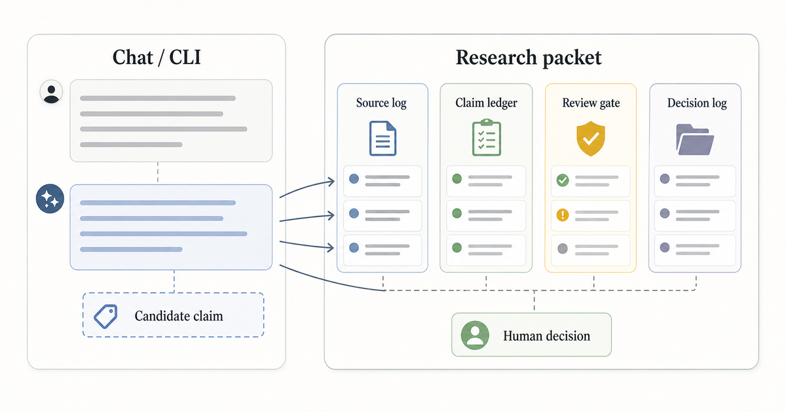
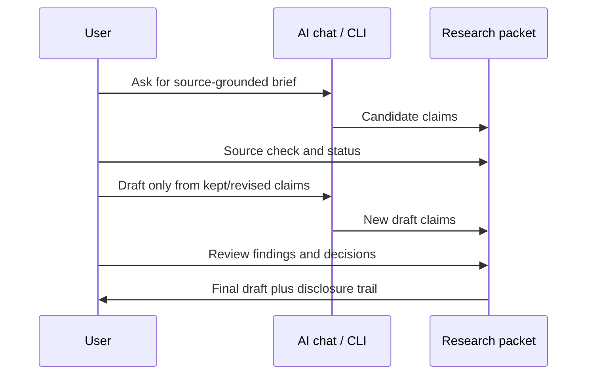

# Interface Walkthrough

This walkthrough shows what the workflow looks like from the user's side.

It is synthetic. It does not describe a private project, an unpublished manuscript or a real review file.

The point is the split: the chat produces useful text, but the research packet records what happened behind it.



## Scenario

Question:

> Under what conditions do major publishers permit AI-assisted research writing?

Output:

> A short briefing paragraph for a policy or research-methods note.

Timebox:

> 30 minutes.

## Split-screen view

| Step | What the user does in chat or CLI | What happens in the research packet |
|---|---|---|
| 1. Set the question | `I am trying to answer: Under what conditions do major publishers permit AI-assisted research writing? I am not asking whether AI should be an author.` | `source-log.md` is created. `claim-ledger.md` is empty. |
| 2. Add sources | User pastes or links publisher guidance, journal policy pages and disclosure guidance. | Each source gets an ID: `S-001`, `S-002`, `S-003`. Limits are recorded, not just relevance. |
| 3. Ask for a brief | `Create a research brief. Assign a claim ID to every important statement. Separate supported claims, uncertain claims and gaps.` | Candidate claims are added to `claim-ledger.md`: `C-001`, `C-002`, `C-003`. |
| 4. Check claims | User reviews each claim against sources. | Claims are marked `Keep`, `Revise` or `Drop`. Weak evidence does not enter the draft. |
| 5. Draft | `Draft one paragraph using only claims marked Keep or Revise. Mark any new factual claim as NEW-CLAIM.` | Draft is created. Any new claim goes back into the ledger. |
| 6. Verify draft | User checks whether the polished paragraph changed the meaning. | A stronger word such as "accepted" may be revised to "permitted under conditions." |
| 7. Review | User runs skeptical reviewer and non-expert reader lenses. | `review-gate.md` records overclaiming, unclear wording and missing qualifiers. |
| 8. Decide | User accepts, revises or drops findings. | `decision-log.md` records the human decision and reason. |
| 9. Disclose | User writes how AI helped. | Disclosure note is added to the final packet. |

## What the chat sees

The chat interface can stay simple.

```text
User:
I am trying to answer: Under what conditions do major publishers permit
AI-assisted research writing?

Do not write a final article yet.
Create a brief with claim IDs.
Separate supported claims, uncertain claims and source gaps.

Sources:
S-001: [publisher policy]
S-002: [journal guidance]
S-003: [disclosure guidance]
```

Possible assistant output:

```text
C-001: Some publishers permit AI-assisted writing tasks when humans remain
responsible for the final content. Supported by S-001 and S-002.

C-002: AI systems can be listed as authors. Not supported; S-002 says human
authors remain accountable. Drop.

C-003: Useful disclosure should name the AI task, tool and human check.
Supported by S-003.

Source gap: none of these sources proves that AI-assisted writing improves
research quality.
```

## What the packet records

### Source log

| ID | Source | Type | Relevance | Limits |
|---|---|---|---|---|
| S-001 | Publisher AI policy | Policy | Shows conditional permission. | One publisher family only. |
| S-002 | Journal author guidance | Guidance | Shows human accountability requirement. | Medical-journal context. |
| S-003 | Disclosure guidance | Guidance | Shows what useful disclosure should contain. | Does not evaluate research quality. |

### Claim ledger

| ID | Claim | Source support | Evidence quality | Confidence | Status | Notes |
|---|---|---|---|---|---|---|
| C-001 | Some publishers permit AI-assisted writing tasks when humans remain responsible for final content. | S-001, S-002 | Medium | High | Keep | Needs "some" and "under conditions." |
| C-002 | AI systems can be listed as authors. | None | Low | High | Drop | Contradicted by author guidance. |
| C-003 | Useful disclosure should name the AI task, tool and human check. | S-003 | Medium | High | Keep | Good candidate for final paragraph. |

### Review gate

| ID | Finding | Severity | Required action | Status |
|---|---|---|---|---|
| R-001 | "Accepted by publishers" is too broad. | Medium | Replace with "permitted under conditions." | Resolved |
| R-002 | The paragraph implies quality improvement without evidence. | High | Drop that sentence. | Resolved |

### Decision log

| ID | Decision | Reason | Evidence / Review input | Owner |
|---|---|---|---|---|
| D-001 | Use "permitted under conditions." | More accurate than "accepted." | C-001, R-001 | Human author |
| D-002 | Drop quality-improvement claim. | Source base does not support it. | R-002 | Human author |

## Final paragraph

> Major publishers increasingly permit some AI-assisted research and writing tasks, but typically require human responsibility, source checking and disclosure. Useful disclosure should say where AI was used, for what task, and how the output was checked. The sources reviewed here do not show that AI-assisted writing improves research quality.

## Why this is different from a chatbot transcript

A transcript shows what was said.

The packet shows what survived checking.

That is the useful distinction. The method does not ask readers to trust the chat. It gives them the pieces they need to inspect the work.


