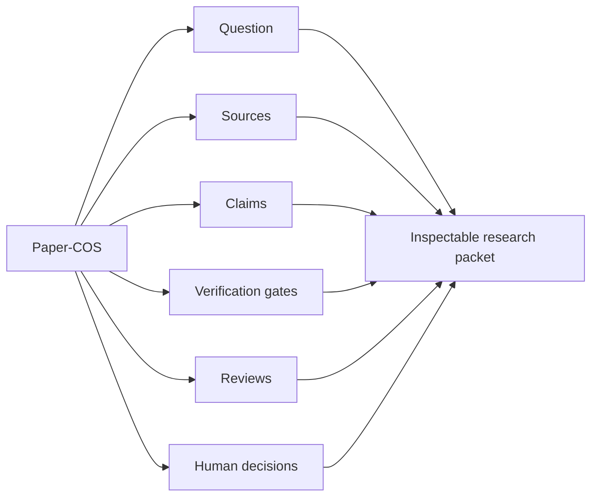

# Paper-COS Pattern

## Definition

Paper-COS names the coordinating role in this workflow.

COS means chief of staff. The role does not author conclusions. It keeps the work organized: question, sources, claims, reviews, decisions.

"Paper" points at the output the role serves: a publishable, inspectable piece of work. It does not mean the role does the writing.

The gates below are the same gates described in [Workflow](workflow.md). This document explains the role and the design principles behind it.

## Responsibilities

Paper-COS coordinates:

- research question framing,
- source intake,
- claim tracking,
- verification gates,
- review loops,
- revision decisions,
- disclosure notes.

Paper-COS does not replace:

- domain expertise,
- statistical or legal methods,
- ethical review,
- peer review,
- author responsibility.

## Core gates

### Orient

Clarify question, audience, scope, boundaries and risks.

### Brief

Build a structured briefing from available sources. Start the claim ledger and source log.

### Verify the brief

Challenge the briefing before drafting. Remove unsupported claims early.

### Draft

Draft from verified materials. Track any new claims that appear during writing.

### Verify the draft

Check the final text again. Good prose can hide source drift.

### Review

Use multiple perspectives to find overclaiming, ambiguity, missing qualifiers, source drift and audience confusion.

### Harden

Make final decisions. Document what changed, what was removed, and what remains with known risk.

## Design principles

- Keep artifacts small enough to inspect.
- Separate evidence quality from confidence.
- Separate AI suggestions from human decisions.
- Treat uncertainty as an output.
- Prefer explicit gates over invisible prompt chains.
- Keep confidential or unpublished material out of public workflow evidence.

## Public-safe claim

Allowed:

> Paper-COS is a model-agnostic coordination pattern for keeping AI-assisted research inspectable.

Avoid:

> Paper-COS produces peer-review-grade papers automatically.
