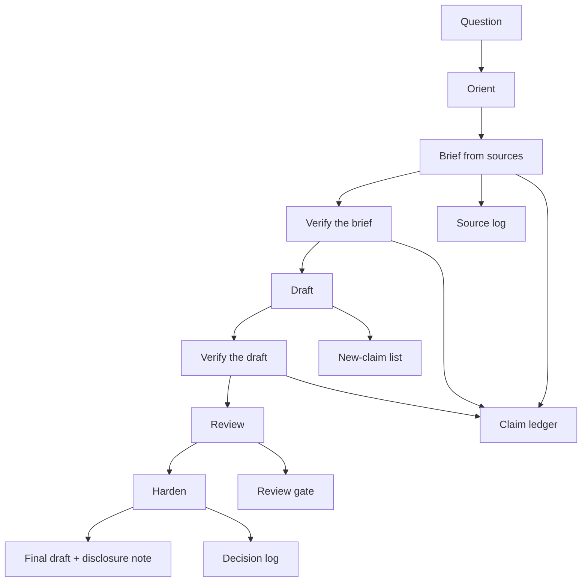
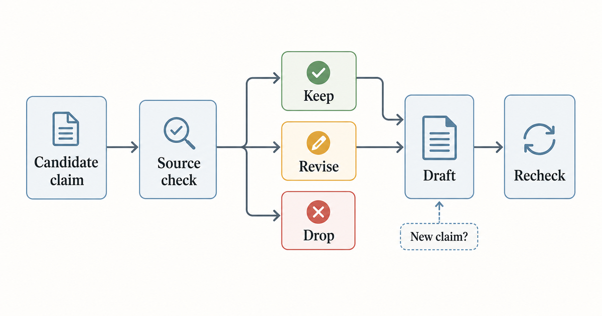
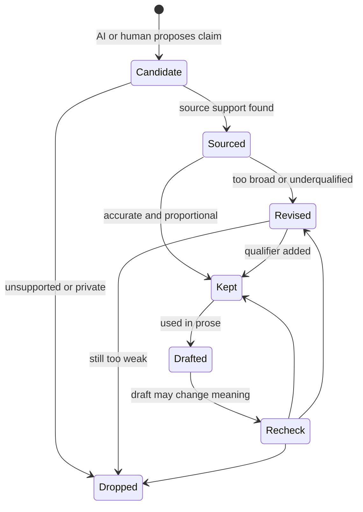

# Workflow

## Goal

A research draft can read well and still be uncheckable.

This workflow shifts the center of gravity. The draft matters, but the artifacts around it matter just as much:

- the question,
- the claim set,
- the source base,
- the uncertainty,
- the review findings,
- the human decisions.

The simplest way to think about it: the AI helps produce candidate material. The workflow makes the candidate material inspectable.

## Minimal workflow

### 1. Orient

Define the research question, domain, intended output and known constraints.

Output:

- research question,
- scope boundaries,
- exclusion list,
- risk notes.

### 2. Brief

Build a first structured briefing from sources and domain context.

Output:

- source log,
- preliminary claim ledger,
- uncertainty list.

### 3. Verify brief

Check each important claim. Is it sourced? Too broad? Underqualified? Unsupported?

Output:

- reviewed claim ledger,
- rejected or downgraded claims,
- source gaps.

### 4. Draft

Draft from verified materials. Watch for new claims that appear during writing.

Output:

- draft,
- draft-to-claim map,
- new-claim list.

### 5. Verify draft

Check the draft again. Drafting often creates claims that were not present in the verified brief.

Output:

- final claim ledger,
- edits required,
- remaining uncertainty.

### 6. Review

Challenge the draft through several lenses: domain expert, skeptical reviewer, non-expert reader and publication-safety reviewer.

Output:

- review findings,
- severity labels,
- revision plan.

### 7. Harden

Resolve the review findings. Decide what remains, what changes, and what gets removed.

Output:

- decision log,
- final disclosure note,
- final unresolved-risk note.

## Claim lifecycle

Most errors enter through a small door: a useful source becomes a slightly broader claim, then the draft turns that broader claim into confident prose.

The claim ledger slows that down.

## Completion criteria

A research artifact is not done because it reads well.

It is done when:

- important claims are traceable,
- source gaps are visible,
- uncertainty is not hidden,
- review findings were resolved or consciously accepted,
- AI use can be disclosed in a specific way,
- a human owner accepts responsibility for the final output.
